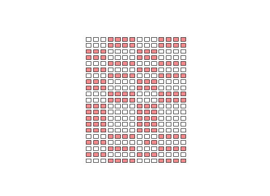

# Quality Control Predictor

## Overview

The goal of this project is to predict if a part coming off of a production line will pass or fail quality control based on a set of measurements the part undergoes throughout its life on a the production line.

This can be useful in any manufacturing setting, so that the quality control phase can be skipped, saving time and energy.

The data used to do this came from Bosch which is available [here](https://www.kaggle.com/c/bosch-production-line-performance/data).

Only the numeric dataset was used in this project. That dataset is extremely sparse, 81% of it is null. In order to deal with this, the data was clustered based on the type of measurements each part received.

### clustering the sparse data

1. Record which row index is not null for every column.

2. Iterate through every column pair, and record how many non null rows they share.

3. Group the column pair that has the highest number of shared non null rows, record which columns have been grouped.

4. Group the column pair with the next highest number of shared non null rows, if neither column has been grouped already form a new group of those two columns. If the first column in the pair has already been grouped add the second column to the group that the first column is in, and vice-versa.

5. Continue to do this until all columns have been grouped.
6. Make clusters of the original dataframe using the column groups, maintaining a unique Id for each row.

7. Drop the rows that are completely null from each cluster.

8. For each cluster record which rows are present and how many nonnull entries each row has.

9. For each row, determine which cluster it has the most non null entries in, and drop that row from every other cluster.

10. Fill any remaining null values for each cluster.

### PCA and Modeling

From each cluster, principal component analysis was preformed (singular value decomposition). As the number of components was iterated through, isolation forest, one class svm, and a decision tree was fit to the data and scored using Matthew's Correlation Coefficient with cross-validation. For each cluster, the combination of number of components and model type with the highest MCC is the chosen model for that cluster.

The models are saved in models/models, the matrix decomposition models are saved in models/pca

run.py file will prompt a user to enter measurements, and from there the data point will be decomposed into principal components and then the appropriate model predicts pass or fail.
